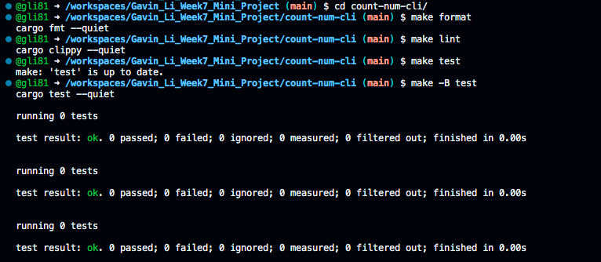

# IDS 706 Data Engineering Week 7 Mini Project

Gavin Li `gl183`

## Purpose of the project

The purpose of this project is to build a rust command line tool as part of the rust lab.

## Result for `make format`, `make lint`, `make test`

- Little bit different from make commands for python projects, for this project, go to the `count-num-cli` folder using `cd` command, then call make commands to work solely on this one project.

## Guideline for my command line tool

## References

* [Rust Collections](https://doc.rust-lang.org/std/collections/index.html)
* [GitHub Copilot CLI](https://www.npmjs.com/package/@githubnext/github-copilot-cli)
* [Rust Fundamentals](https://github.com/alfredodeza/rust-fundamentals)
* [Rust Tutorial](https://nogibjj.github.io/rust-tutorial/)
* [Rust MLOps Template](https://github.com/nogibjj/mlops-template)
